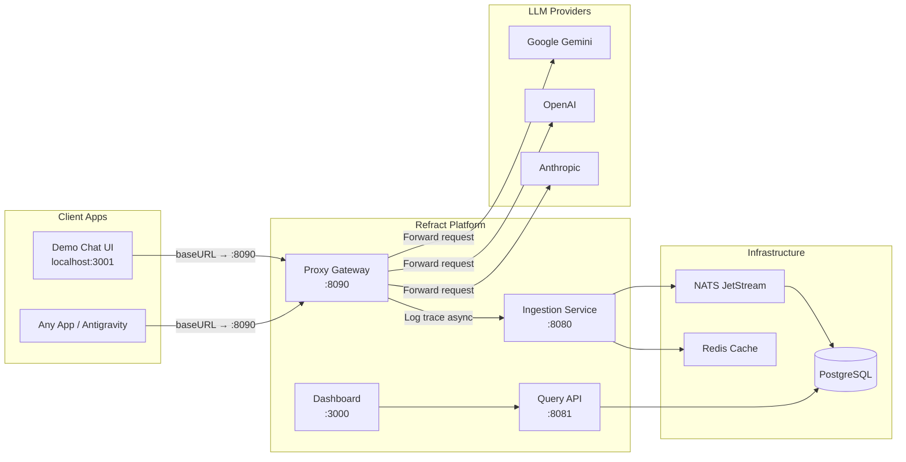

# Refract — Implementation Plan

> Transforming Lumina (open-source LLM observability) into **Refract** — a proxy-based AI observability & cost-optimization platform for the AiGENThix Hackathon.

---

## Architecture Overview



### How the Proxy Works (Middleman Pattern)

1. A client app (demo chat, Antigravity, any LLM app) sets its **base URL** to point at the Refract Proxy (`http://localhost:8090`) instead of the real provider.
2. The proxy receives the request, extracts prompt/model info, starts a latency timer.
3. It forwards the request to the **real LLM provider** (Gemini, OpenAI, etc.).
4. On response, it parses token usage from the provider's response body.
5. It **asynchronously** sends a trace to the Ingestion Service (fire-and-forget, so latency isn't added to the client's request).
6. The unmodified response is returned to the client — **fully transparent**.

---

## Phase 0 — Global Rename: Lumina → Refract

> **Goal:** Replace all references to "Lumina" / "lumina" / "@uselumina" with "Refract" / "refract" / "@refract" throughout the codebase.

### Files to Modify

| Scope     | Files                                                | Changes                                                                                                        |
| --------- | ---------------------------------------------------- | -------------------------------------------------------------------------------------------------------------- |
| Root      | `package.json`                                       | `"name": "lumina"` → `"name": "refract"`                                                                       |
| Root      | `.env.example`, `.env.docker`, `.env.docker.example` | All `lumina` references → `refract` (DB name, NATS stream, env vars like `LUMINA_API_KEY` → `REFRACT_API_KEY`) |
| Docker    | `infra/docker/docker-compose.yml`                    | Container names (`lumina-postgres` → `refract-postgres`), DB creds, network name                               |
| Dashboard | `apps/dashboard/package.json`                        | `"name": "@lumina/dashboard"` → `"name": "@refract/dashboard"`                                                 |
| Dashboard | `apps/dashboard/app/layout.tsx`                      | Title, theme storage key, description                                                                          |
| Dashboard | `apps/dashboard/app/page.tsx`                        | All user-facing "Lumina" text → "Refract"                                                                      |
| SDK       | `packages/sdk/package.json`                          | `"name": "@uselumina/sdk"` → `"name": "@refract/sdk"`                                                          |
| Services  | `services/*/src/server.ts`                           | Health check names, log messages                                                                               |
| Schema    | `packages/database/src/schema/index.ts`              | Comment: "Lumina Database Schema" → "Refract Database Schema"                                                  |
| Schema    | `packages/schema/`                                   | Package name                                                                                                   |
| Core      | `packages/core/`                                     | Package name                                                                                                   |
| Config    | `packages/config/`                                   | Package name                                                                                                   |
| README    | `README.md`                                          | Full rebrand                                                                                                   |

> [!IMPORTANT]
> The provider CHECK constraint in `traces.ts` currently only allows `'openai', 'anthropic', 'cohere', 'other'`. We need to add `'google'` for Gemini support.

### Verification

- `grep -ri "lumina" --include="*.ts" --include="*.tsx" --include="*.json" --include="*.yml" --include="*.md"` should return zero results (except in `bun.lock` and git history).

---

## Phase 1 — Database Schema Updates

> **Goal:** Add prompt analysis columns to the traces table and update the provider constraint.

### [MODIFY] `packages/database/src/schema/traces.ts`

```diff
     // Status
     status: varchar('status', { length: 20 }).notNull(),
     errorMessage: text('error_message'),
+
+    // Prompt Analysis (added for Refract)
+    promptCategory: varchar('prompt_category', { length: 50 }),
+    promptComplexity: varchar('prompt_complexity', { length: 20 }),  // 'simple' | 'moderate' | 'complex'
+    modelFit: varchar('model_fit', { length: 30 }),                 // 'underkill' | 'good_fit' | 'overkill'
+    modelFitReason: text('model_fit_reason'),
+    source: varchar('source', { length: 20 }).default('sdk'),       // 'sdk' | 'proxy'
```

Add indexes:

```diff
+    promptCategoryIdx: index('idx_prompt_category').on(table.promptCategory),
+    sourceIdx: index('idx_source').on(table.source),
```

Update provider CHECK constraint:

```diff
-    sql`${table.provider} IN ('openai', 'anthropic', 'cohere', 'other')`
+    sql`${table.provider} IN ('openai', 'anthropic', 'google', 'cohere', 'other')`
```

### [NEW] Migration

Create a new migration file in `packages/database/src/migrations/` for the schema changes.

### Verification

- Run `bun run migrate` — migration applies cleanly.
- Query `\d traces` in psql to confirm new columns exist.

---

## Phase 2 — Proxy Gateway Service

> **Goal:** A new HTTP service that acts as a transparent middleman between any LLM client and the real provider.

### [NEW] `services/proxy/`

```
services/proxy/
├── package.json
├── tsconfig.json
├── src/
│   ├── server.ts           # Hono server on port 8090
│   ├── routes/
│   │   ├── google.ts       # Google Gemini proxy (primary)
│   │   ├── openai.ts       # OpenAI-compatible proxy
│   │   └── health.ts       # Health check
│   ├── lib/
│   │   ├── trace-sender.ts # Async trace ingestion via HTTP POST
│   │   ├── cost-calculator.ts  # Model → price lookup
│   │   └── provider-config.ts  # Provider URLs & supported models
│   └── types/
│       └── index.ts
```

### Key Design Decisions

1. **Gemini-first** — Since you have Gemini API keys, the primary proxy route handles Google's `generateContent` API format.
2. **OpenAI-compatible route** — Also supports OpenAI's `/v1/chat/completions` format for broader compatibility.
3. **No NATS dependency** — The proxy sends traces to the Ingestion Service over HTTP (`POST /v1/traces`), keeping it lightweight and independently deployable.
4. **Provider API key management** — The proxy reads `GEMINI_API_KEY`, `OPENAI_API_KEY`, etc. from env vars. Clients don't need to send their own keys (the proxy manages them).

### Proxy Request Flow (Gemini Example)

```
Client POST /v1/proxy/google/generateContent
  ├── Extract: model, prompt text, generation config
  ├── Start timer
  ├── Forward to: https://generativelanguage.googleapis.com/v1beta/models/{model}:generateContent
  ├── Parse response: output text, token counts (promptTokenCount, candidatesTokenCount)
  ├── Calculate cost using model pricing table
  ├── Fire-and-forget: POST trace to Ingestion Service
  └── Return unmodified response to client
```

### `services/proxy/src/server.ts` (outline)

```typescript
import { Hono } from 'hono';
import { cors } from 'hono/cors';
import { logger } from 'hono/logger';
import googleRoutes from './routes/google';
import openaiRoutes from './routes/openai';

const app = new Hono();

app.use('*', logger());
app.use('*', cors({ origin: '*' }));

app.get('/health', (c) => c.json({ status: 'ok', service: 'refract-proxy' }));

// Google Gemini proxy
app.route('/v1/proxy/google', googleRoutes);

// OpenAI-compatible proxy
app.route('/v1/proxy/openai', openaiRoutes);

const port = parseInt(process.env.PROXY_PORT || '8090');
console.log(`🔀 Refract Proxy starting on port ${port}...`);

export default { port, fetch: app.fetch };
```

### `services/proxy/src/routes/google.ts` (outline)

```typescript
// POST /v1/proxy/google/generateContent
// Body: { model, contents, generationConfig, ... }
// 1. Read GEMINI_API_KEY from env
// 2. Forward to Google API
// 3. Parse usageMetadata from response
// 4. Send trace to ingestion (async)
// 5. Return original response
```

### `services/proxy/src/lib/cost-calculator.ts`

Model pricing table (per 1M tokens):

| Model            | Input | Output |
| ---------------- | ----- | ------ |
| gemini-2.0-flash | $0.10 | $0.40  |
| gemini-2.5-flash | $0.15 | $0.60  |
| gemini-2.5-pro   | $1.25 | $10.00 |
| gpt-4o           | $2.50 | $10.00 |
| gpt-4o-mini      | $0.15 | $0.60  |
| claude-sonnet-4  | $3.00 | $15.00 |

### Docker Integration

Add to `infra/docker/docker-compose.yml`:

```yaml
proxy:
  build:
    context: ../../
    dockerfile: services/proxy/Dockerfile
  container_name: refract-proxy
  environment:
    PROXY_PORT: 8090
    INGESTION_URL: http://ingestion:8080
    GEMINI_API_KEY: ${GEMINI_API_KEY}
    OPENAI_API_KEY: ${OPENAI_API_KEY:-}
  ports:
    - '8090:8090'
  depends_on:
    - ingestion
  networks:
    - refract
```

### Env Variables

Add to `.env.example` and `.env.docker`:

```
PROXY_PORT=8090
GEMINI_API_KEY=your-gemini-api-key-here
INGESTION_URL=http://localhost:8080
NEXT_PUBLIC_PROXY_URL=http://localhost:8090
```

### Verification

- `curl -X POST http://localhost:8090/v1/proxy/google/generateContent -H "Content-Type: application/json" -d '{"model":"gemini-2.0-flash","contents":[{"parts":[{"text":"Hello"}]}]}'` → returns Gemini response.
- Check dashboard → new trace appears with `source: 'proxy'`, `provider: 'google'`, correct token counts.

---

## Phase 3 — Prompt Analyzer

> **Goal:** On-demand prompt analysis using a lightweight LLM call to categorize prompts and assess model fit.

### How It Works

The Prompt Analyzer is **not** called on every trace automatically. It's triggered:

1. **Via the Dashboard** — user clicks "Analyze" on a specific trace.
2. **Via API** — `POST /api/analyze-prompt` endpoint.

This keeps costs controlled while providing deep analysis when needed.

### [NEW] `services/api/src/routes/prompt-analysis.ts`

```typescript
// POST /prompt-analysis/analyze
// Body: { traceId, spanId }
// 1. Fetch the trace from DB (get prompt + model)
// 2. Call Gemini with a meta-prompt:
//    "Analyze this prompt. Classify it into a category,
//     rate its complexity, and assess if the model used
//     is overkill/underkill/good fit."
// 3. Parse structured response
// 4. Update the trace row with analysis results
// 5. Return analysis to caller
```

### Meta-Prompt for Analysis

```
You are a prompt analysis engine. Given the following:
- Prompt: "{prompt_text}"
- Model used: "{model_name}"
- Provider: "{provider}"

Respond with JSON only:
{
  "category": "one of: code_generation, creative_writing, data_extraction, summarization, translation, general_chat, reasoning, math, other",
  "complexity": "one of: simple, moderate, complex",
  "model_fit": "one of: underkill, good_fit, overkill",
  "model_fit_reason": "brief explanation, e.g. 'This is a simple greeting; gemini-2.5-pro is overkill, consider gemini-2.0-flash'",
  "suggested_model": "cheaper model suggestion if overkill, null if good_fit"
}
```

### Model Fit Logic

| Prompt Complexity | Model Tier             | Verdict      |
| ----------------- | ---------------------- | ------------ |
| simple            | cheap (flash/mini)     | ✅ good_fit  |
| simple            | expensive (pro/sonnet) | ⚠️ overkill  |
| complex           | cheap (flash/mini)     | ⚠️ underkill |
| complex           | expensive (pro/sonnet) | ✅ good_fit  |

### [MODIFY] `services/api/src/server.ts`

```diff
+ import promptAnalysisRoutes from './routes/prompt-analysis';
  // ...
+ app.route('/prompt-analysis', promptAnalysisRoutes);
```

### Verification

- Send a simple prompt through the proxy → manually trigger analysis → verify `prompt_category`, `prompt_complexity`, `model_fit` columns are populated.
- Dashboard shows the analysis results on the trace detail view.

---

## Phase 4 — Demo Chat Interface

> **Goal:** A simple but polished chat UI that routes through the Refract Proxy, generating real traces for dashboard demonstration.

### [NEW] `apps/demo-chat/`

A standalone HTML + JS page (no framework needed) or a tiny Next.js app. For hackathon speed, we'll make it a **single-page app** served by the proxy itself or as a static file.

### Option: Static HTML served by the Proxy

```
services/proxy/public/
└── demo.html    # Self-contained chat interface
```

The proxy serves it at `GET /demo`.

### Features

- Clean chat interface with message bubbles
- Model selector dropdown (gemini-2.0-flash, gemini-2.5-flash, gemini-2.5-pro)
- Shows real-time metrics per message: tokens used, cost, latency
- "View in Dashboard" link per message that deep-links to the trace
- Conversation history in the session

### Chat Flow

```
User types message
  → POST /v1/proxy/google/generateContent (to our proxy)
  → Proxy forwards to Gemini, logs trace, returns response
  → Chat UI displays response + inline metrics
```

### Verification

- Open `http://localhost:8090/demo` in browser.
- Send a few messages → switch to dashboard at `:3000` → verify traces appear with all metrics.

---

## Phase 5 — Dashboard Enhancements

> **Goal:** Add new visualizations and pages for prompt analysis and proxy data.

### [MODIFY] `services/api/src/routes/analytics.ts`

Add new endpoint:

```typescript
// GET /cost/categories
// Returns prompt category distribution: { category, count, totalCost, avgLatency }
// Grouped by promptCategory column
```

### [MODIFY] `apps/dashboard/app/page.tsx`

Add to the main dashboard:

1. **Prompt Category Pie Chart** — Distribution of prompt types (using Recharts PieChart)
2. **Model Fit Summary** — Card showing % of prompts that are overkill/underkill/good_fit
3. **Source Distribution** — Badge showing SDK vs Proxy trace counts
4. **Potential Savings** — Calculated from overkill model-fit traces

### [NEW] Dashboard page: Prompt Analyzer page

New route at `/prompt-analysis` in the dashboard:

- Table of recent traces with prompt preview
- "Analyze" button per trace (calls `POST /prompt-analysis/analyze`)
- Results inline: category badge, complexity indicator, model-fit verdict with reasoning
- Batch analyze option for multiple traces

### [MODIFY] Sidebar Navigation

Add new nav items:

- "Prompt Analysis" (link to `/prompt-analysis`)
- Keep existing: Overview, Traces, Cost, Alerts, Replay

### Unique KPIs & Visualizations (Refract Differentiators)

These are the metrics that make Refract **not just another GitHub observability clone**:

#### Refract-Exclusive KPIs

| KPI                             | What It Measures                                                 | Why It's Unique                             |
| ------------------------------- | ---------------------------------------------------------------- | ------------------------------------------- |
| **Prompt Efficiency Score**     | Ratio of output tokens to input tokens (higher = more efficient) | No other tool rates prompt efficiency       |
| **Model-Task Alignment**        | Is the model overkill/underkill for the task complexity?         | LLM-powered meta-analysis unique to Refract |
| **Token Waste Ratio**           | Estimated % of tokens wasted due to overengineered prompts       | Quantifies prompt optimization opportunity  |
| **Cost per Useful Token**       | Cost normalized by actual output relevance                       | Goes beyond raw cost tracking               |
| **Time-to-Value (TTV)**         | Latency per useful output token                                  | Combines speed + quality into one metric    |
| **Model Cascading Opportunity** | % of requests that could use a cheaper model                     | Directly actionable savings metric          |
| **Estimated Monthly Savings**   | Projected savings if all overkill prompts used suggested models  | Dollar-value optimization output            |
| **Prompt Verbosity Index**      | How wordy the prompt is vs task complexity                       | Identifies prompt bloat                     |

#### Enhanced Dashboard Charts

1. **Prompt Complexity Heatmap** — Time-of-day × complexity, colored by cost intensity
2. **Model Fit Donut Chart** — overkill / good_fit / underkill distribution with savings callout
3. **Cost vs Efficiency Scatter Plot** — Each trace plotted by cost (x) vs efficiency score (y), color-coded by model
4. **Token Flow Breakdown** — Stacked bar: prompt tokens vs completion tokens per endpoint
5. **Savings Opportunity Funnel** — Visual funnel: total spend → overkill spend → estimated savings
6. **Provider Mix Treemap** — Proportional area chart of spend across providers/models
7. **Latency Distribution Histogram** — P50/P95/P99 with real-time markers
8. **Request Volume Sparklines** — Inline mini-charts per endpoint in the trace table

#### Dashboard Cards (Top-Level Metrics)

- **Total Spend** with trend arrow and % change
- **Avg Prompt Efficiency** score (0-100)
- **Model Alignment Score** — % of requests using the right-sized model
- **Potential Monthly Savings** — dollar amount from model cascading opportunities
- **Active Endpoints** — count with most expensive highlighted
- **Error Rate** with severity breakdown

### Verification

- Dashboard loads without errors.
- Prompt category chart renders with data from analyzed traces.
- Model fit summary shows correct percentages.

---

## Phase 6 — Setup & Run from Scratch

### Prerequisites

- [Bun](https://bun.sh/) installed
- [Docker Desktop](https://www.docker.com/products/docker-desktop/) installed and running
- Gemini API key from [Google AI Studio](https://aistudio.google.com/apikey)

### Steps

```bash
# 1. Install dependencies
cd d:\Uni Stuff\Internships\AiGENThix\Refract
bun install

# 2. Create .env.docker with your keys
# (we'll generate this file during implementation)

# 3. Start infrastructure (Postgres, NATS, Redis)
cd infra/docker
docker compose up -d postgres nats redis

# 4. Wait for services to be healthy
docker compose ps

# 5. Run database migrations
cd ../..
bun run migrate

# 6. Start all services in dev mode (separate terminals)
bun run dev:ingestion    # Port 8080
bun run dev:api          # Port 8081
bun run dev:proxy        # Port 8090 (new!)
cd apps/dashboard && bun run dev  # Port 3000

# 7. Open demo chat
# Navigate to http://localhost:8090/demo

# 8. Open dashboard
# Navigate to http://localhost:3000
```

---

## Implementation Order

> [!TIP]
> **Recommended sequence for fastest working demo:**

| Step | Phase                                  | Est. Time | Priority  |
| ---- | -------------------------------------- | --------- | --------- |
| 1    | Phase 0 — Rename Lumina → Refract      | 20 min    | 🔴 High   |
| 2    | Phase 1 — Database schema updates      | 10 min    | 🔴 High   |
| 3    | Phase 2 — Proxy Gateway (Gemini route) | 45 min    | 🔴 High   |
| 4    | Phase 4 — Demo Chat Interface          | 30 min    | 🔴 High   |
| 5    | Phase 3 — Prompt Analyzer              | 30 min    | 🟡 Medium |
| 6    | Phase 5 — Dashboard Enhancements       | 30 min    | 🟡 Medium |

**Total estimated: ~2.5 hours** to have a fully working demo.

---

## Questions for You

> [!IMPORTANT]
> **Please confirm before we start:**
>
> 1. **Gemini API key** — Do you have one ready? We'll need it in `.env.docker` and `.env`. (We'll use `gemini-2.0-flash` as the default model for both the demo chat and the prompt analyzer to keep costs low.)
> 2. **Docker Desktop** — Is it installed and running on your machine? We need it for PostgreSQL, NATS, and Redis.
> 3. **Bun** — Is Bun installed? (`bun --version` in terminal). The project uses Bun as its runtime.
> 4. **Renaming scope** — Should we rename the GitHub remote/repo references too, or just the code? (For hackathon, code-only is fine.)
> 5. **Ready to start?** — If all the above checks out, I'll begin with Phase 0 (renaming) immediately.
